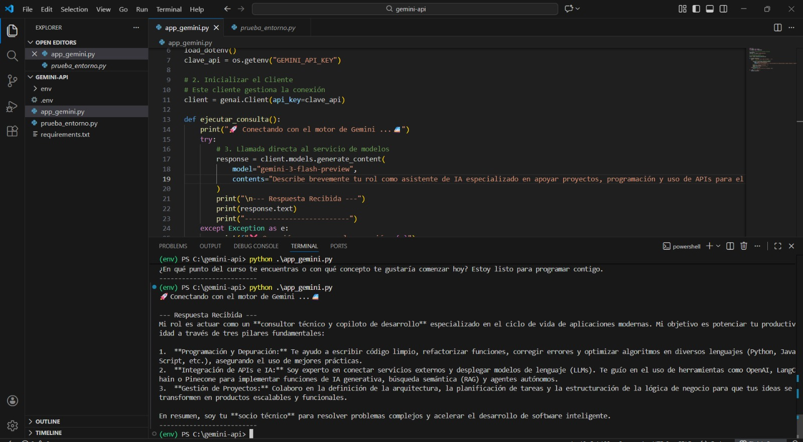

#  Conexión a la API de Gemini con Python

Este proyecto demuestra cómo realizar la conexión a la API de Google Gemini utilizando Python de forma segura y organizada.

---

##  Instalación y Configuración

### 1. Clonar el repositorio
```bash
git clone [https://github.com/linaasco/Conexion_API.git](https://github.com/linaasco/Conexion_API.git)
cd Conexion_API
2. Crear el entorno virtual
Bash
python -m venv venv
3. Activar el entorno virtual
En Windows:

PowerShell
.\venv\Scripts\activate
En Linux / macOS:

Bash
source venv/bin/activate
4. Instalar dependencias
Si tienes problemas con el comando pip directo, usa el prefijo de python:

Bash
python -m pip install -r requirements.txt
5. Crear el archivo .env
En la raíz del proyecto, crea un archivo llamado .env y agrega tu API Key:

Fragmento de código
GEMINI_API_KEY=TU_API_KEY_AQUI
Nota: Reemplaza TU_API_KEY_AQUI por tu clave real obtenida en Google AI Studio.

6. Ejecutar el script
Bash
python app_gemini.py

Evidencia de ejecución

